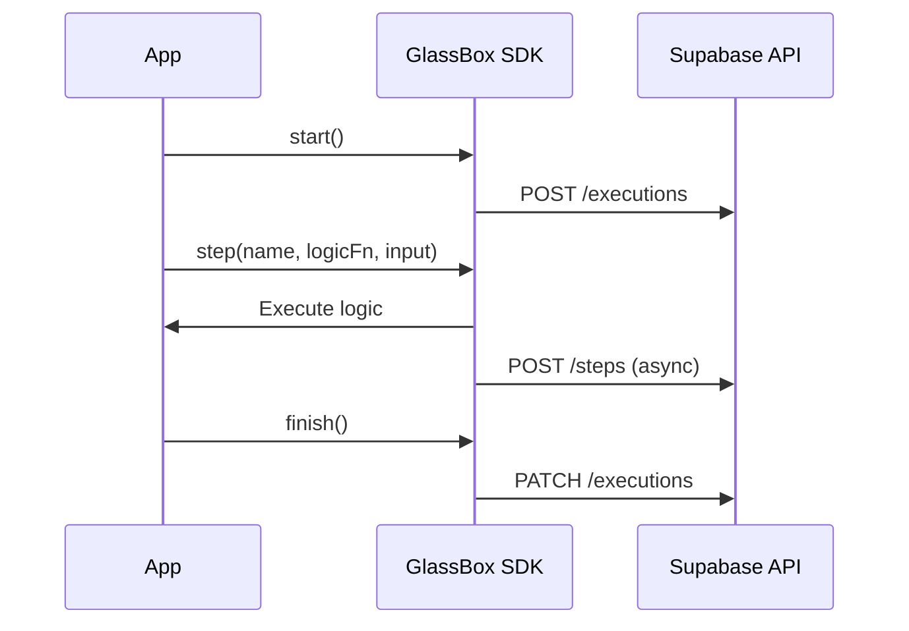

# GlassBox Architecture

**An X-Ray system for debugging multi-step, non-deterministic algorithmic pipelines.**

---

## System Overview

GlassBox has three components: **SDK** (captures decisions), **API** (Supabase REST), and **Dashboard** (visualizes traces).



**Key Design:** Non-blocking, fire-and-forget logging. If the API is down, the app continues working.

---

## 1. Data Model Rationale

### Schema

```sql
executions (id, name, status, metadata jsonb, created_at)
steps (id, execution_id, step_name, step_order, input jsonb, output jsonb, reasoning text, status, duration_ms)
```

### Why JSONB?

**Decision:** Use `jsonb` for `input`, `output`, and `metadata` instead of structured columns.

**Rationale:** Different pipelines have different data shapes. Competitor search outputs products; categorization outputs category IDs. JSONB allows arbitrary structures without schema migrations.

**Alternatives Considered:**

- **Separate tables per step type** - Rejected. Requires migrations for every new pipeline.
- **MongoDB** - Rejected. Need relational JOINs (executions ↔ steps) and ACID guarantees.

**What Would Break:** If we used separate tables, adding a new pipeline type would require database migrations. With JSONB, developers just send different JSON shapes.

### Why `reasoning` as TEXT?

Always human-readable prose, not structured data. Enables full-text search: "Find all steps where reasoning mentions 'price too low'".

### Why `step_order`?

Async logging means timestamps can arrive out-of-order. `step_order` is set synchronously in the SDK before async logging, guaranteeing correct timeline visualization.

---

## 2. Debugging Walkthrough

**Scenario:** Competitor search returns a phone case instead of a laptop stand.

**Steps:**

1. Go to `/xray`, find the execution
2. Click "View Trace"
3. **Step 1 - Keyword Generation:** Check if LLM generated "phone" instead of "laptop"
4. **Step 2 - Candidate Search:** See how many products were retrieved (0 = keywords too specific, 1000+ = too broad)
5. **Step 3 - Apply Filters:** Dashboard shows which filters the phone case passed/failed with specific reasons: "Price $8.99 < $10.00 minimum"
6. **Step 4 - LLM Relevance:** Check if LLM classified phone case as TRUE_MATCH (bug) or FALSE_POSITIVE (correct)
7. **Step 5 - Rank & Select:** See "WHY SELECTED" and "WHY NOT #1" explanations

**Root Cause:** The dashboard shows exactly which step failed and why. Without X-Ray, you'd only see the bad output and guess.

---

## 3. Queryability

**Challenge:** How to query across different pipelines (competitor search, categorization, listing optimization)?

**Solution:** Conventions + JSONB queries.

**Example 1:** Find runs where filtering eliminated >90% of candidates

```sql
SELECT e.name,
       (s.output->>'failed_count')::float / (s.output->>'total_evaluated')::float as rejection_rate
FROM executions e
JOIN steps s ON s.execution_id = e.id
WHERE s.step_name = 'apply_filters'
  AND (s.output->>'failed_count')::float / (s.output->>'total_evaluated')::float > 0.9;
```

**Example 2:** Find all LLM steps that took >5 seconds

```sql
SELECT e.name, s.step_name, s.duration_ms
FROM executions e
JOIN steps s ON s.execution_id = e.id
WHERE s.step_name LIKE '%llm%' AND s.duration_ms > 5000;
```

**Constraints on Developers:**

- Use consistent step names (`apply_filters`, `llm_relevance_evaluation`)
- Follow output structure conventions (e.g., `{total_evaluated, passed_count, failed_count}` for filter steps)
- Add `metadata` tags: `{pipeline_type: "competitor_search"}`

**Trade-off:** Flexibility (JSONB) vs. Queryability (strict schemas). We chose flexibility, accepting that cross-pipeline queries require conventions.

---

## 4. Performance & Scale

**Problem:** A filtering step processes 5,000 candidates → 30. Capturing full details for all 5,000 creates 1MB+ JSONB payloads.

**Current Implementation:** Demo captures **full details** for all candidates (completeness over performance).

**Production Approach:** Tiered logging—let developers choose:

```typescript
await xray.step(
  "apply_filters",
  async () => ({
    output: {
      total_evaluated: 5000,
      passed_count: 30,
      evaluations: [
        ...passedCandidates, // All 30 passed
        ...failedCandidates.slice(0, 50), // Sample 50 failed
      ],
      rejection_summary: {
        price_too_low: 3200,
        rating_too_low: 1500,
      },
    },
  }),
  input,
  { detailLevel: "summary" }
);
```

**Who Decides?** The developer at instrumentation time. They know which steps are high-volume.

**Future:** Offload large payloads to S3, store reference in DB: `{storage_url: "s3://bucket/step-2.json"}`.

---

## 5. Developer Experience

### Minimal Instrumentation (3 lines)

```typescript
const xray = new GlassBox("My Pipeline");
await xray.start();
// ... existing code ...
await xray.finish("completed");
```

**Result:** Execution tracking (start/end times, status) but no step-level visibility.

### Full Instrumentation

Wrap each step:

```typescript
const keywords = await xray.step(
  "keyword_generation",
  async () => ({
    output: await generateKeywords(input),
    reasoning: "Generated search terms from product name",
  }),
  { input_product: "Water Bottle" }
);
```

**Result:** Full step-by-step visibility with reasoning.

### If X-Ray Backend is Down

SDK fails gracefully—returns `null` from `start()`, skips logging, runs business logic normally. **Zero downtime.**

---

## 6. Real-World Application

**Background:** E-commerce recommendation engine with 6-step pipeline (user profiling → candidate generation → filtering → ML ranking → diversification → selection).

**Problem:** Recommendations were poor (winter coats in summer). Debugging took 2-4 hours:

- Add print statements
- Re-run pipeline
- Hope issue reproduces (often didn't due to non-determinism)
- Manually inspect logs

**With GlassBox:** 10 minutes. View trace, see Step 2 reasoning: "Retrieved 200 trending products (winter coats trending in Australia)". Root cause: no seasonal filter. Fix: add location-based seasonal filter.

**Time saved:** 2-4 hours → 10 minutes per bug.

---

## 7. Future Roadmap

**Production Priorities:**

1. **Decouple from Supabase** - Generic storage interface (support MongoDB, ClickHouse, S3)
2. **Sampling & Rate Limiting** - Only log 10% of production traffic to avoid DB overload
3. **PII Redaction** - Auto-redact emails, credit cards from input/output
4. **Alerting** - Webhook when execution fails; Slack notification if >10 failures/hour
5. **Metrics & Analytics** - Aggregate stats (avg duration per step, failure rate, P95 latencies)
6. **Multi-Language SDKs** - Python, Go, Java
7. **OpenTelemetry Integration** - Export as OpenTelemetry spans
8. **Retention Policies** - Auto-delete executions >30 days old
9. **Trace Comparison** - Side-by-side diff of two executions
10. **Real-Time Updates** - WebSocket for live dashboard updates

---

## API Specification

**Base URL:** `https://YOUR_PROJECT.supabase.co/rest/v1`

**Authentication:** `apikey: YOUR_SUPABASE_ANON_KEY`

### Endpoints

**Create Execution**

```http
POST /executions
{"name": "Competitor Analysis", "status": "running", "metadata": {...}}
→ Returns: {id, created_at, ...}
```

**Log Step**

```http
POST /steps
{"execution_id": "...", "step_name": "keyword_generation", "step_order": 1,
 "input": {...}, "output": {...}, "reasoning": "...", "duration_ms": 1250}
```

**Update Execution**

```http
PATCH /executions?id=eq.{id}
{"status": "completed"}
```

**List Executions**

```http
GET /executions?select=*&order=created_at.desc&limit=50
```

**Get Steps**

```http
GET /steps?execution_id=eq.{id}&select=*&order=step_order.asc
```

---

## Conclusion

GlassBox answers **"Why this decision?"** not just **"What happened?"**

**Design Priorities:**

- **Developer experience** - Non-intrusive, fail-safe
- **Flexibility** - JSONB allows arbitrary pipelines
- **Debuggability** - Reasoning captures the "why"

**Trade-offs:**

- Flexibility over strict schemas (JSONB vs. structured tables)
- Simplicity over scalability (Supabase vs. custom backend)
- Completeness over performance (full capture vs. sampling)

For production: sampling, PII redaction, retention policies, and OpenTelemetry integration.
