<p align="center">
  
  
  
  
</p>

<h1 align="center">🔍 GlassBox</h1>

<p align="center">
  <strong>An X-Ray system for debugging multi-step, non-deterministic algorithmic pipelines.</strong>
</p>

<p align="center">
  <em>See through your algorithms. Understand why decisions are made, not just what happened.</em>
</p>

---

## 📋 Table of Contents

- [The Problem](#-the-problem)
- [The Solution](#-the-solution)
- [Architecture Overview](#-architecture-overview)
- [Project Structure](#-project-structure)
- [Quick Start](#-quick-start)
- [SDK Usage Guide](#-sdk-usage-guide)
- [Dashboard Features](#-dashboard-features)
- [Demo Application](#-demo-application)
- [Database Schema](#-database-schema)
- [Known Limitations](#-known-limitations)
- [Future Improvements](#-future-improvements)

---

## 🎯 The Problem

Modern software increasingly relies on **multi-step, non-deterministic processes**:

- An LLM generates search keywords from a product description
- A search API returns thousands of results
- Filters narrow down candidates based on business rules
- A ranking algorithm selects the final output

**Traditional logging tells you _what_ happened, but not _why_ a particular decision was made.**

When the final output is wrong, you're left reverse-engineering the entire pipeline. GlassBox solves this.

---

## 💡 The Solution

GlassBox provides **transparency into multi-step decision processes** by capturing:

| What Traditional Tracing Captures | What GlassBox Captures                |
| --------------------------------- | ------------------------------------- |
| Function calls & timing           | **Decision reasoning**                |
| Service spans                     | **Candidates evaluated**              |
| "What happened?"                  | **"Why this output?"**                |
| Performance metrics               | **Filter logic & selection criteria** |

---

## 🏗 Architecture Overview

GlassBox consists of three main components that work together to provide complete visibility into algorithmic pipelines:


### Data Flow Architecture

Here's how data flows through the system during a typical execution:


---

## 📁 Project Structure

```
glassbox/
├── src/
│   ├── app/
│   │   ├── page.tsx              # Landing page
│   │   ├── layout.tsx            # Root layout with fonts
│   │   ├── globals.css           # Global styles + glassmorphism
│   │   │
│   │   ├── demo/                 # 🚀 Demo Application
│   │   │   ├── page.tsx          # Competitor Finder UI
│   │   │   ├── actions.ts        # Server actions (pipeline logic)
│   │   │   └── data.ts           # Filter rules & category mappings
│   │   │
│   │   └── xray/                 # 📊 X-Ray Dashboard
│   │       ├── page.tsx          # Executions list view
│   │       └── [id]/
│   │           └── page.tsx      # Trace detail view
│   │
│   └── lib/
│       ├── glassbox.ts           # 📦 THE SDK - Core library
│       ├── supabase.ts           # Supabase client
│       └── puter-llm.ts          # Puter.js LLM wrapper
│
├── supabase.sql                  # Database schema + seed data
├── .env.local                    # Environment variables
└── package.json
```

### Key Files Explained

| File                         | Purpose                                                               |
| ---------------------------- | --------------------------------------------------------------------- |
| `src/lib/glassbox.ts`        | **The SDK** - Lightweight wrapper class for capturing decision trails |
| `src/app/demo/actions.ts`    | Server-side pipeline logic with GlassBox instrumentation              |
| `src/app/xray/[id]/page.tsx` | Rich visualization of step-by-step decision reasoning                 |
| `supabase.sql`               | Complete database schema with 35 seed products                        |

---

## 🚀 Quick Start

### Prerequisites

- Node.js 18+
- A [Supabase](https://supabase.com) account (free tier works)

### 1. Clone & Install

```bash
git clone https://github.com/AtharvRG/glassbox.git
cd glassbox
npm install
```

### 2. Set Up Supabase

1. Create a new Supabase project
2. Go to **SQL Editor** and run the contents of `supabase.sql`
3. Copy your project URL and anon key from **Settings → API**

### 3. Configure Environment

Create `.env.local` in the project root:

```env
NEXT_PUBLIC_SUPABASE_URL=https://YOUR_PROJECT.supabase.co
NEXT_PUBLIC_SUPABASE_ANON_KEY=your-anon-key-here
```

### 4. Run the Development Server

```bash
npm run dev
```

Open [http://localhost:3000](http://localhost:3000) and you're ready to go!

---

## 📦 SDK Usage Guide

The GlassBox SDK is designed to be **lightweight, non-intrusive, and general-purpose**. It wraps your existing logic without changing its behavior.

### Core Concepts


### Basic Usage

```typescript
import { GlassBox } from "@/lib/glassbox";

// 1. Create an instance for your pipeline
const xray = new GlassBox("My Pipeline Name");

// 2. Start a new execution session
const executionId = await xray.start({
  user_id: "abc123",
  environment: "production",
});

// 3. Wrap each step of your logic
const keywords = await xray.step(
  "keyword_generation", // Step name
  async () => ({
    // Your actual logic
    output: await generateKeywords(input),
    reasoning: "Extracted key product attributes: material, size, features",
  }),
  { input_product: "Water Bottle" } // Input context for debugging
);

// 4. Run more steps...
const candidates = await xray.step(
  "search",
  async () => ({
    output: await searchProducts(keywords),
    reasoning: `Found ${results.length} products matching search terms`,
  }),
  { keywords }
);

// 5. Mark execution as complete
await xray.finish("completed"); // or 'failed'
```

### The `StepResult` Pattern

Every step must return a `StepResult<T>` object:

```typescript
type StepResult<T> = {
  output: T; // The actual return value of your logic
  reasoning?: string; // The "Why" - human-readable explanation
};
```

**The `reasoning` field is what makes GlassBox powerful.** It captures the _why_ behind each decision.

### Design Principles

| Principle            | Implementation                                         |
| -------------------- | ------------------------------------------------------ |
| **Non-blocking**     | Step logging is fire-and-forget (`then()` not `await`) |
| **Fail-safe**        | If logging fails, your app continues working           |
| **General-purpose**  | Works with any pipeline, not just competitor search    |
| **Minimal overhead** | Only adds ~5-10ms per step for DB write                |

---

## 📊 Dashboard Features

### Executions List (`/xray`)

The main dashboard shows all pipeline executions with:

- Execution name and UUID
- Status badge (completed ✓, failed ✗, running ⏳)
- Relative timestamp
- Quick navigation to detailed trace

### Trace Detail View (`/xray/[id]`)

The trace detail page provides a **timeline visualization** of each step:

```mermaid
flowchart TD
    subgraph Step1["🧠 keyword_generation"]
        I1[/"Input: 'Water Bottle'"/]
        O1[/"Output: ['insulated', 'stainless steel', ...]"/]
        R1["💡 Reasoning: Extracted key product attributes"]
    end

    subgraph Step2["🔍 candidate_search"]
        I2[/"Keywords from Step 1"/]
        O2[/"7 products found"/]
        R2["💡 Reasoning: Queried products table, filtered by category"]
    end

    subgraph Step3["🔸 apply_filters"]
        I3[/"7 candidates"/]
        O3[/"4 passed, 3 rejected"/]
        R3["💡 Reasoning: Applied price>$10, rating≥3.5, reviews≥100"]

        subgraph Evaluations
            E1["✓ HydroFlask - PASSED all filters"]
            E2["✗ Cheap Bottle - FAILED: price $5.99 < $10"]
        end
    end

    subgraph Step4["✨ llm_relevance_evaluation"]
        I4[/"4 qualified products"/]
        O4[/"TRUE_MATCH: 2, ALTERNATIVES: 2"/]
        R4["💡 LLM classified each product's relevance"]
    end

    subgraph Step5["🎯 rank_and_select"]
        I5[/"Ranked candidates"/]
        O5[/"Winner: Yeti Rambler"/]
        R5["💡 WHY SELECTED: Highest reviews + best value ratio"]
        R6["💡 WHY NOT #1: HydroFlask - Lower review count"]
    end

    Step1 --> Step2 --> Step3 --> Step4 --> Step5
```



### Key Dashboard Features

| Feature                      | Description                                               |
| ---------------------------- | --------------------------------------------------------- |
| **Reasoning Highlight**      | Every step shows its reasoning in a prominent callout     |
| **Filter Breakdown**         | See exactly which filters each candidate passed/failed    |
| **Specific Failure Reasons** | "Price $8.99 < $10.00 minimum" instead of just "failed"   |
| **LLM Classifications**      | TRUE_MATCH, CLOSE_ALTERNATIVE, FALSE_POSITIVE with scores |
| **Selection Explanation**    | Why the winner was chosen AND why others weren't #1       |

---

## 🎮 Demo Application

The included demo application showcases GlassBox with a **Competitor Product Finder** pipeline.

### Pipeline Steps

```mermaid
flowchart LR
    A["🔤 User Input<br/>'Water Bottle'"] --> B["🧠 Keyword Generation<br/>(Gemini LLM)"]
    B --> C["🔍 Candidate Search<br/>(Supabase Query)"]
    C --> D["🔸 Apply Filters<br/>(Business Rules)"]
    D --> E["✨ Relevance Eval<br/>(Gemini LLM)"]
    E --> F["🎯 Rank & Select<br/>(Gemini LLM)"]
    F --> G["📊 View in Dashboard"]

    style B fill:#a855f7
    style E fill:#ec4899
    style F fill:#10b981
```



### Sample Data

The demo comes with **35 products** across 6 categories:

- Water Bottles (7 products)
- Running Shoes (6 products)
- Wireless Earbuds (6 products)
- Backpacks (6 products)
- Yoga Mats (5 products)
- Tumblers (5 products)

### Filter Rules

| Filter      | Threshold | Reasoning                                     |
| ----------- | --------- | --------------------------------------------- |
| Min Price   | > $10.00  | Filters out accessories and low-quality items |
| Min Rating  | ≥ 3.5★    | Ensures baseline quality                      |
| Min Reviews | ≥ 100     | Ensures market validation                     |

---

## 🗄️ Database Schema


### Key Fields

| Table        | Field              | Purpose                                        |
| ------------ | ------------------ | ---------------------------------------------- |
| `steps`      | `reasoning`        | The core X-Ray feature - captures the "why"    |
| `steps`      | `input` / `output` | Full context for debugging                     |
| `steps`      | `duration_ms`      | Performance profiling                          |
| `executions` | `metadata`         | Arbitrary context (user_id, environment, etc.) |

---

## ⚠️ Known Limitations

1. **Supabase Dependency**  
   The SDK is currently tightly coupled to Supabase. A more generic storage interface would improve portability.

2. **No Real-time Updates**  
   The dashboard requires a page refresh to see new executions; WebSocket integration would enable live updates.

3. **No Trace Comparison**  
   Cannot compare two executions side-by-side to identify differences.

4. **No Retention Policies**  
   Old executions accumulate indefinitely; auto-cleanup would be beneficial.

5. **Single-tenant Design**  
   No user authentication or multi-tenant isolation for production use.

---

## 📄 License

MIT License - Feel free to use this in your own projects.

---

<p align="center">
  <strong>Built for the Founding Full-Stack Engineer Take-Home Assignment</strong><br/>
  <em>Demonstrating system design, SDK architecture, and dashboard UX</em>
</p>
